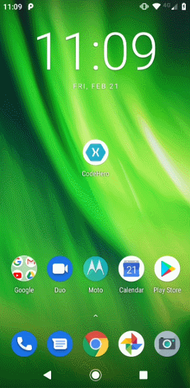

# CodeHero

Aplicativo mobile para busca de personagens Marvel. Teste de desenvolvimento proposto pela Objective Solutions.

## Demo

## Visão Geral

Aplicativo desenvolvido em Xamarin com base nas especificações técnicas do Projeto Code Hero. Não foi possível desenvolver a paginação numerada conforme especificações. Como alternativa, foi desenvolvida uma listagem com scroll infinito para apresentação de mais personagens. O aplicativo conta também com filtro por nome e tela de detalhes de personagem.   

## Plataformas

* Android: testado
* iOS: não testado (Mac indisponível para execução e testes)

## Pré-requisitos

Sistema operacional `Windows` ou `macOS`. Assegure-se de ter [Visual Studio](https://visualstudio.microsoft.com) instalado na máquina utilizada.

## Executando testes

No `Visual Studio` acesse o `Test Explorer` para executar os testes unitários.

## Desenvolvido com

* [Xamarin.Forms](https://dotnet.microsoft.com/apps/xamarin/xamarin-forms) - Framework multiplataforma para desenvolvimento de aplicativos mobile
* [FreshMvvm](https://github.com/rid00z/FreshMvvm) - Framework MVVM utilizado
* [Akavache](https://github.com/reactiveui/Akavache) - Biblioteca utilizada para persistência local de dados
* [NUnit](https://nunit.org/) - Framework de testes unitários utilizado
* [Moq](https://github.com/Moq/moq4/) - Framework de mocking utilizado
